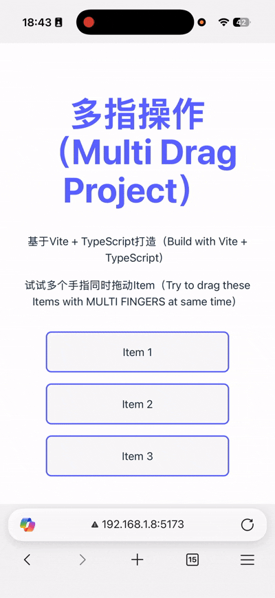

# 多指操作（Multi Drag Project）

## DEMO



[DEMO](https://systemui-js.github.io/multi-drag/)

## 特性（Features）

支持多个手指**同时**拖动多个元素（当然也支持鼠标拖动）

Support MULTI fingers drag MULTI Items(also support mouse dragging)

## 现代化打包构建工具，支持TS（Modern tools of Project Building, support TypeScript）

基于Vite + TypeScript打造

Build with Vite + TypeScript

## API 文档（中文）

> 本文档涵盖 `Drag`、`makeDraggable`、`dragManager`/`DragManager`、拖拽手势方法（`dragMethods`）与工具库（`MatrixTransforms`、`MathUtils`）。示例均为 TypeScript，示例中包含注释以帮助理解。

### 安装与引入

```bash
# 安装
yarn add multi-drag
# 或
npm i multi-drag
```

```ts
// 典型引入方式
import {
  Drag,
  dragManager,
  makeDraggable,
  getPoseFromElement,
  applyPoseToElement,
  keepTouchesRelative,
  MatrixTransforms,
  MathUtils
} from 'multi-drag'
```

### 快速开始

```ts
// 让一个元素具备拖拽能力（单指或鼠标）
const box = document.getElementById('box') as HTMLElement

// 使用 makeDraggable 自动处理位移（left/top）
const drag = makeDraggable(box, {
  // 可选：自定义读取当前位置信息
  getPosition: (el) => ({
    x: parseFloat(getComputedStyle(el).left) || 0,
    y: parseFloat(getComputedStyle(el).top) || 0
  }),
  // 可选：自定义写入位置的方式
  setPosition: (el, pos) => {
    el.style.left = `${pos.x}px`
    el.style.top = `${pos.y}px`
  }
})

// 销毁
// drag.destroy()
```

---

### Drag 类

```ts
new Drag(element: HTMLElement, options?: DragOptions)
```

- 参数：
  - `element`：要拖拽的元素。
  - `options`：回调配置。
    - `onDragStart?(element, events)`：开始拖拽时回调。
    - `onDragMove?(element, events)`：拖拽过程中回调。
    - `onDragEnd?(element, events)`：结束拖拽时回调。
- 方法：
  - `getElement(): HTMLElement`：返回绑定的元素。
  - `getIsDragging(): boolean`：当前是否在拖拽。
  - `destroy(): void`：注销当前实例。

```ts
interface DragOptions {
  onDragStart?: (element: HTMLElement, events: DragEvent[]) => void
  onDragMove?: (element: HTMLElement, events: DragEvent[]) => void
  onDragEnd?: (element: HTMLElement, events: DragEvent[]) => void
}
```

- 说明：`events` 为标准化的指针事件数组，兼容鼠标与触摸，便于多指场景。

### makeDraggable 函数

```ts
function makeDraggable(
  element: HTMLElement,
  options?: {
    getPosition?: (el: HTMLElement) => { x: number; y: number }
    setPosition?: (el: HTMLElement, pos: { x: number; y: number }) => void
  }
): Drag
```

- 作用：为元素提供“拖拽即位移”的快捷能力。
- 默认行为：
  - `getPosition` 默认从 `style.left/top` 读取；
  - `setPosition` 默认写入到 `style.left/top`；
  - 若元素 `position` 为 `static`，会自动设置为 `relative` 以便移动。

### dragManager 与 DragManager

- `dragManager`：单例，自动挂载文档级监听，聚合多指事件并分发给相应的 `Drag` 实例。
- 关键行为：
  - 多指/鼠标事件的标准化（统一为 `DragEvent`）；
  - 将同一元素上的多触点“成组”分发；
  - 跟踪活跃拖拽指针，并在 `end` 时正确清理。

```ts
interface DragEvent {
  identifier: string | number
  clientX: number
  clientY: number
  target: EventTarget | null
  originalEvent: MouseEvent | TouchEvent
  type: 'mouse' | 'touch'
}
```

- 常用方法：
  - `dragManager.isDragging(): boolean`
  - `dragManager.getRegisteredInstances(): Drag[]`
  - `dragManager.getActiveDrags(): Map<string | number, Drag>`
  - `dragManager.isElementBeingDragged(el: HTMLElement): boolean`

> 一般无需直接调用 `register/unregister`，`new Drag(...)` 会自动注册，`destroy()` 会自动注销。

### 拖拽手势方法（dragMethods）

- `getPoseFromElement(element): Pose`
  - 读取元素 `DOMRect` 与关键 `style` 的“快照”以避免叠加污染。
- `applyPoseToElement(element, pose, options?)`
  - 仅应用必要的样式属性，避免 transform 叠加。
- `keepTouchesRelative(params, options?)`
  - 在单指/多指拖拽过程中，使触点在元素中的相对位置保持稳定；
  - 支持同时移动、缩放、旋转的组合；
  - 单指场景支持优先级配置：`['drag']`/`['scale']`/`['rotate']`。

```ts
interface Pose { rect: DOMRect; style: CSSStyleDeclaration }
interface Point { x: number; y: number }
interface GestureParams {
  element: HTMLElement
  initialPose: Pose
  startEvents: DragEvent[]
  currentEvents: DragEvent[]
}
interface ApplyPoseOptions {
  transformOrigin?: string
  transition?: string
}
interface KeepTouchesRelativeOptions extends ApplyPoseOptions {
  enableScale?: boolean
  enableRotate?: boolean
  enableMove?: boolean
  singleFingerPriority?: ('scale' | 'rotate' | 'drag')[]
}
```

示例：结合 `keepTouchesRelative` 实现“多指移动/旋转/缩放”。

```ts
const el = document.getElementById('target') as HTMLElement

let initialPose: Pose
const drag = new Drag(el, {
  onDragStart: (_el, startEvents) => {
    // 在拖拽开始时拍下元素姿态快照
    initialPose = getPoseFromElement(el)
  },
  onDragMove: (_el, currentEvents) => {
    // 将起始/当前触点列表传入，计算并应用新的姿态
    keepTouchesRelative(
      {
        element: el,
        initialPose,
        startEvents: [], // 可存储第一次 onDragStart 的 events
        currentEvents // 当前 move 事件的触点列表
      },
      {
        enableMove: true,
        enableScale: true,
        enableRotate: true,
        transformOrigin: 'center center'
      }
    )
  }
})
```

> 注意：示例中 `startEvents`/`currentEvents` 的管理策略可按需缓存与传递，只要满足 `GestureParams` 的约定即可。

### 工具类 MatrixTransforms

```ts
class MatrixTransforms {
  static poseToMatrix(pose: Pose)
  static calculateTransformDelta(fromPose: Pose, toPose: Pose)
  static calculateRelativePosition(
    touchPoint: [number, number],
    elementCenter: [number, number],
    elementSize: [number, number],
    pose: Pose
  )
  static calculateNewTouchPosition(
    relativePosition: { relativeX: number; relativeY: number },
    newElementCenter: [number, number],
    newElementSize: [number, number],
    newPose: Pose
  ): [number, number]
  static interpolatePose(fromPose: Pose, toPose: Pose, t: number): Pose
}
```

- 用途：简化复杂几何变换/插值的计算，内部配合 `MathUtils`。

### 数学工具 MathUtils 及导出

```ts
class MathUtils {
  static createTransformMatrix(tx: number, ty: number, sx: number, sy: number, rotRad: number)
  static transformPoint(point: [number, number], mat: any)
  static distance(p1: [number, number], p2: [number, number]): number
  static angle(p1: [number, number], p2: [number, number]): number
  static evaluate(expression: string, scope?: Record<string, any>): any
  static degToRad(deg: number): number
  static radToDeg(rad: number): number
}

// 还会转出常用 math.js 方法
export { evaluate, matrix, multiply, subtract, add, norm, cos, sin, pi }
```

---

### 版本与类型

- 项目使用 TypeScript 提供完整类型定义，详见 `dist/*.d.ts`。
- 任何 API 变动会在发布说明中记录。
